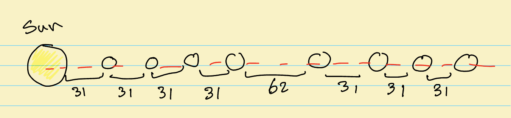
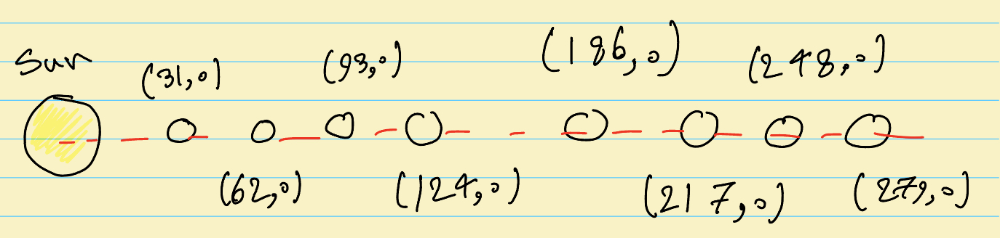
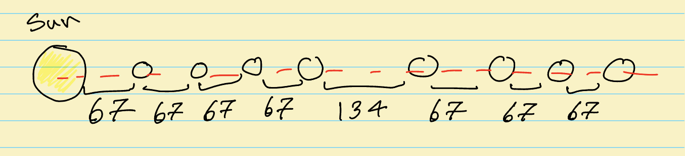
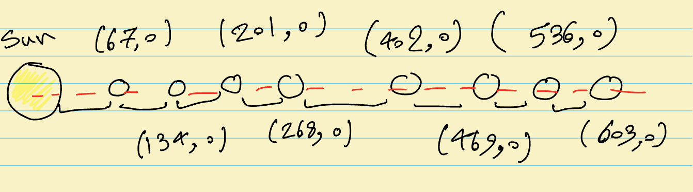

# Designing a Function for a Circular Solar System Simulation

## Objective

This is complementary material for section 1.3 (The Function Design Recipe) of the CSC148 course. Here, we want to see the process of writing a function that will be used in this beautiful, circular solar system visualization! Here's what we are asked to do:

> Assume that the planets start moving around the sun from the horizontal line on the right of the sun that goes through the middle of the screen. Given the distances between planets and the screen size, return the x and y coordinates of the starting position of each planet. As an example, assume the following given distances between planets in million km: `[31, 31, 31, 31, 62, 31, 31, 31]`, which produces the above animation. Note that the distance between the sun and the closest planet is the first entry which is 31 million km. Return the initial (x,y) coordinates for each planet.

Before we start writing a program, we often have a vague idea, such as the one above, of what we want to write. Programming languages are just tools for us to turn our thoughts into something more practical. However, programming languages have limited capabilities, and we need to simplify our thought process to be able to express our ideas using the functionality and syntax of the programming language.

Let's get back to our problem. We have some distances between planets. What is the objective? What are the inputs? What are the expected outputs? Let's use pen and paper to understand what these distances represent. The question mentions a horizontal line that goes through the middle of the screen and planets start moving from there. Let's start with something like the sketch below to visualize the problem:

Now we have some intuition about what these distances are. Assuming the screen is _really big_, what would be the current output coordinates?

Here, we assume that the Sun is located at the (0,0) coordinate, so the height (y) of the horizontal line is zero. So far we know the coordinates of the starting points if we have a big enough screen! But what if we have a limited screen size, and we want to use as much of the screen as possible when displaying our visualization of the solar system? For example, if the width of the screen is 600 pixels, what would be the proportional distances between planets?

The furthest planet is 279 million km, computed by summing up all the distances! Now on our computer screen, the furthest planet should be 600 pixels away from the center of sun! So we need to convert these distances to our screen size! Let's use some math to determine how to rescale our coordinates.

$$
\frac{600}{297} \approx 2.15
$$

Then, the distance of 31 million km in the solar system is around 67 pixels on our screen (by multiplying 31 by our scaling factor)! So we now have a routine to convert the given distance in million km to pixels! Now we can rewrite the distances based on our screen size as below:

As before, we can compute the (x,y) coordinates as follows:

We observe that the 603 is more than 600 because we didn't precisely do the conversion (i.e., each 67 is really more like 66.667, so this extra 0.333 adds up to make our rough numbers not add up to exactly 600). This is something that we should keep in mind when we get to our actual coding. If we want to approximate, we should ensure that we do not violate the screen size! With this simple pen and paper sketching done, we now have some idea of how to approach writing the code! To summarize it quickly, we start as follows:

1. We compute the maximum distance between the furthest planet and the sun.
2. We use this distance and the screen size to scale the distances to be proportional to the screen.
3. Since the coordinates are on the horizontal line in the middle of the screen, the height is zero and the x-values are computed based on the distance of each planet to the sun.

Let's go to the [Implementation](../Implementation/README.md) section!
