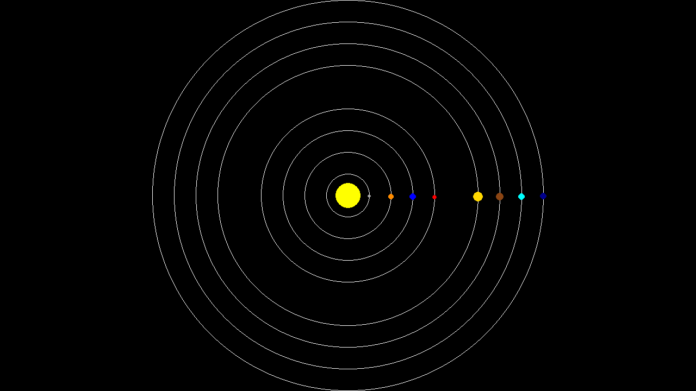

# Designing a Function for a Circular Solar System Simulation

## Objective

This practice is complementary material for section 1.3 of the CSC148 course presented at UofT. Here, we want to see the process of writing a function that will be used in this beautiful circular solar system with unique distances between planets! Here's what we are asked to do:

> Assume that the planets start moving around the sun from the horizontal line on the right of the sun that goes through the middle of the screen. Given the distances between planets and the screen size, return the x and y coordinates of the starting position of each planet. As an example, assume the following given distances between planets in million KM: [31, 31, 31, 62, 31, 31, 31], which produces the above animation. Note that the distance between the sun and the closest planet is also 31 million KM. Return the (x,y) coordinates for each planet.

Before we start writing a program, we often have a vague idea, such as the one above, of what we want to write. Programming languages are just tools for us to lay down our thoughts. However, they have limited capabilities, and we need to simplify our thought process to be able to implement them.

Let's get back to our problem. We have some distances between planets. What is the objective? What are the inputs? What are the expected outputs? We have some distances! Let's use pen and paper to understand what these distances represent. The question mentions a horizontal line that goes through the middle of the screen and planets start moving from there. Imagining a really big screen, the distance between each planet is given. So we can draw something like the sketch below.

So now we have some intuition about what these distances are. Assuming the really big screen is equal to the solar system, what would be the current output coordinates?

Ok, so far we know the coordinates of the starting points if we have the big screen! But we have a limited screen size! Looking at the animation above, we don't have a very big screen. For example, if the height of the screen is 600 pixels, what would be the proportional distances between planets? First, we can observe that we have the big screen size! It is 279 million KM, computed by summing up all the distances! Now in our computer, the furthest planet would be 600 pixels away from the sun! So we need to convert these distances to our screen size! Let's use some math!

$$
\frac{279}{600} = \frac{31}{x} \rightarrow \frac{600 \times 31}{279} \approx 67
$$

Then, the distance of 31 million KM in the solar system is around 67 pixels on our screen! So we now have a routine to convert the given distance in million KM to pixels! Now we can rewrite the distances based on our screen size as below:

We can now compute the (x,y) coordinates as follows:

The 603 is more than 67 because the actual number is 66.6667. This is something that we should keep in mind for coding. If we want to approximate, we should ensure that we do not violate the screen size. With this simple pen and paper sketching, we now have some idea of how to write the code! To summarize it quickly, we start as follows:

1. We compute the maximum distance between the furthest planet and the sun.
2. We use this distance and the screen size to scale the distances proportionally to the screen.
3. Since the coordinates are on the horizontal line in the middle of the screen, the height is zero and the x-values are computed based on the distance of each planet to the sun.

Let's go to the [Implementation](../Implementation/step_by_step_implementation.md) section!