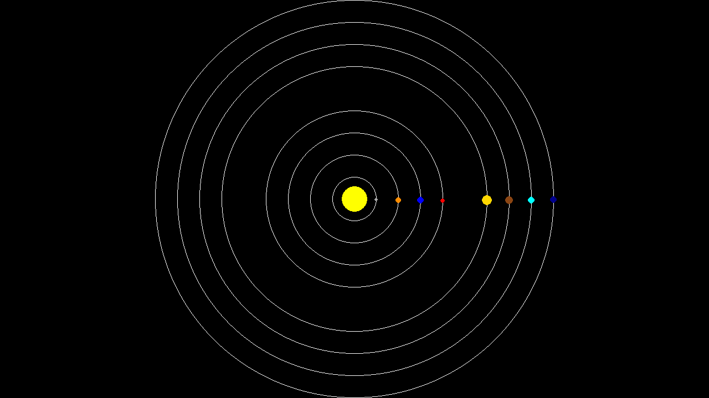
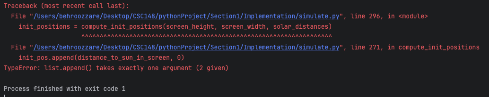
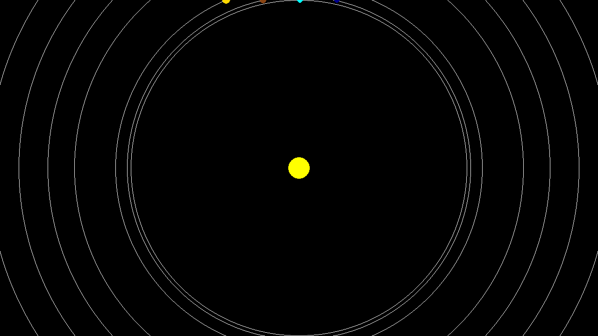
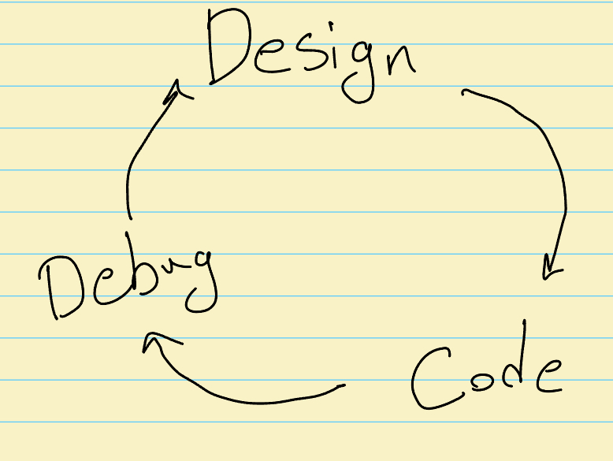
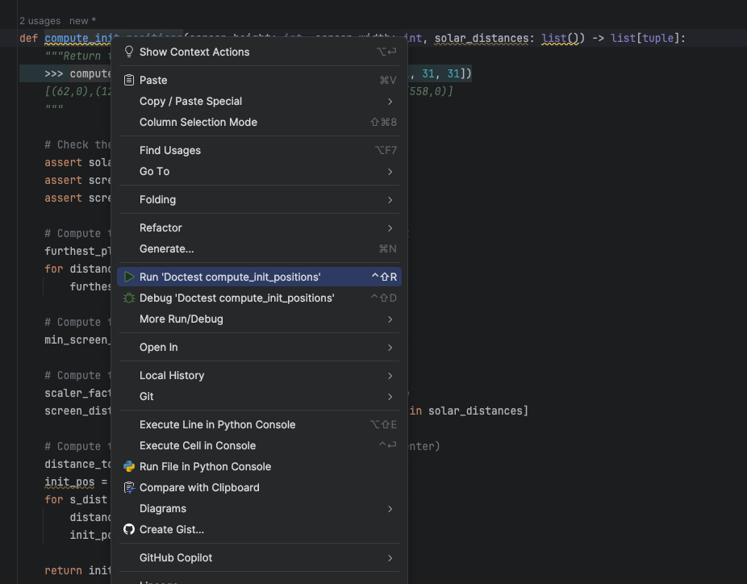

# Implement a Function for a Circular Solar System Simulation

## Objective

Now that we've sketched a simple process for solving the problem defined in the [Design Section](../Design/README.md), we need to start converting those thoughts into code! Let's follow the step-by-step guide provided in the course notes.

### Step 1: Write Example Uses
We have already gone through the process in the [Design Section](../Design/README.md)! To have a simpler output instead of (66.6667, 0), we can consider the screen size to be 558 instead of 600 pixels so $558 \div 279 = 2$. Then we can simply multiply each of the distances by 2! This will turn the output to `[(62,0),(124,0),(186,0),(248,0),(372,0),(434,0),(496,0), (558,0)]`. 

### Step 2: Write the Function Header

Since we are not writing the function from scratch and we want to see the effect of our code in the solar system simulator, the function recipe is given to us!

```python
def compute_init_positions(screen_height, screen_width, solar_distances):
```

Seeing the function definition, we face the first problem. While we know what `solar_distances` is, instead of a single size for the screen, we have two sizes! This means that we did not consider that the screen is not square. Let's look back at our simulator above! We see that the last planet's distance is constrained by the height of the screen. So should we consider only the `screen_height` parameter? What if the width was smaller? Can we make our code more general with a small effort? Well, we can assume the screen size parameter in the [Design Section](../Design/README.md) as the minimum of the two sizes! So our screen size is now:

```python
screen_size = min(screen_height, screen_width)
```

### Step 3: Write the Function Description

Let's follow the tasks of writing all these things! It is hard! It is boring! But trust me, having comments, input-output checks, etc., in your code will improve your mental health in the long run! Also, embrace this boredom (quoted from [Deep Work](https://www.goodreads.com/book/show/25744928-deep-work))!

```python
def compute_init_positions(screen_height: int, screen_width: int, solar_distances: list()) -> list[tuple]:
    """Return the initial position of each planet
    >>> compute_init_positions(558,992,[31, 31, 31, 31, 62, 31, 31, 31])
    [(62,0),(124,0),(186,0),(248,0),(372,0),(434,0),(496,0), (558,0)]
    """
```

### Step 4: Implement the Function Body

Ok, let's get real! Based on the [Design Section](../Design/README.md), the first step is:

> 1. We compute the maximum distance between the furthest planet and the sun.

Let's code this part:

```python
def compute_init_positions(screen_height: int, screen_width: int, solar_distances: list()) -> list[tuple]:
    """Return the initial position of each planet
    >>> compute_init_positions(558,992,[31, 31, 31, 31, 62, 31, 31, 31])
    [(62,0),(124,0),(186,0),(248,0),(372,0),(434,0),(496,0), (558,0)]
    """
    # Check the precondition
    assert solar_distances != []  
    assert screen_height != 0
    assert screen_width != 0

    # Compute the distance between the sun and the last planet
    furthest_planet_distance = sum(solar_distances)
```

In this example, we use the `sum` function to compute the total distance between the sun and the last planet. This simplifies the code and avoids the manual loop.

Now in this part, I chose to make the function fail when the screen is not defined properly or the distances are not given. However, when you design your code, you can choose the behavior of your function in these cases and write code to handle these appropriately. 

Let's move on to the next step mentioned in the [Design Section](../Design/README.md):

> 2. We use this distance and the screen size to scale the distances proportionally to the screen.

How can we code this? We have already seen the math as below:

$$
\frac{279}{600} = \frac{31}{x} \rightarrow \frac{600 \times 31}{279} \approx 67
$$

What are these values in our code? The 279 is already computed in the variable `furthest_planet_distance`. What is 600? It is the screen size. However, at that time our understanding of the problem was not complete as the screen is not square. So now the variable that defines 600 is `screen_size` mentioned in [Step 2](#step-2-write-the-function-header). What is 31? Well, it is one of the distances derived from the `solar_distances` list. So we are basically doing this for each entry in `solar_distances` to compute the proportional distance:

$$
 \frac{screen\_size}{furthest\_planet\_distance} \times solar\_distances[i] 
$$

Let's add this to the code!

```python
def compute_init_positions(screen_height: int, screen_width: int, solar_distances: list()) -> list[tuple]:
    """Return the initial position of each planet
    >>> compute_init_positions(558,992,[31, 31, 31, 31, 62, 31, 31, 31])
    [(62,0),(124,0),(186,0),(248,0),(372,0),(434,0),(496,0), (558,0)]
    """

    # Check the precondition
    assert solar_distances != []
    assert screen_height != 0
    assert screen_width != 0

    # Compute the distance between the sun and the last planet
    furthest_planet_distance = sum(solar_distances)

    # Compute the screen size
    screen_size = min(screen_height, screen_width)

    # Compute the scaling factor
    scaling_factor = screen_size / furthest_planet_distance
    screen_distances = [distance * scaling_factor for distance in solar_distances]
```

Now we are reaching the final step of our first design outline, which is:

> 3. Since the coordinates are on the horizontal line in the middle of the screen, the height is zero and the x-values are computed based on the distance of each planet to the sun.

Let's implement this! 

```python
def compute_init_positions(screen_height: int, screen_width: int, solar_distances: list()) -> list[tuple]:
    """Return the initial position of each planet
    >>> compute_init_positions(558,992,[31, 31, 31, 31, 62, 31, 31, 31])
    [(62,0),(124,0),(186,0),(248,0),(372,0),(434,0),(496,0), (558,0)]
    """

    # Check the precondition
    assert solar_distances != []
    assert screen_height != 0
    assert screen_width != 0

    # Compute the distance between the sun and the last planet
    furthest_planet_distance = sum(solar_distances)

    # Compute the screen size
    screen_size = min(screen_height, screen_width)

    # Compute the scaling factor
    scaling_factor = screen_size / furthest_planet_distance
    screen_distances = [distance * scaling_factor for distance in solar_distances]

    # Compute the distance between each planet and sun (the center)
    distance_to_sun_in_screen = 0
    init_pos = []
    for s_dist in screen_distances:
        distance_to_sun_in_screen += s_dist
        init_pos.append(distance_to_sun_in_screen, 0)

        assert distance_to_sun_in_screen <= screen_size
    
    return init_pos
```

We save the distance to the sun in the `distance_to_sun_in_screen` variable like what we sketched with pen and paper in the [Design Section](../Design/README.md). The y-axis should be zero as the sun is the center. So the `x = distance_to_sun_in_screen` and the `y = 0` and for each planet, we append this coordinate into the `init_pos` variable. Note that we also put an assert to make sure that the 'distance_to_sun_in_screen' is not violating the basic rule that we saw in [Design Section](../Design/README.md). That is, no planet should be out of the screen! Let's copy this code into [simulate.py](simulate.py) and replace the empty function.

```python
def compute_init_positions(screen_height: int, screen_width: int, solar_distances: list()) -> list[tuple]:
    pass
```

By running the function, we face an error in all red! Welcome to the world of programming! If I wrote a code that worked on the first attempt, I would be really scared because it is very rare to write correct code on the first attempt! I suspect that you will also get this feeling somewhere in your coding journey!



Let's analyze this error. It says `Traceback (most recent call last)`. To understand this line, in high-level explanation, Python runs the code line by line. That is, it consecutively executes the lines that you have written. However, when it reaches a function, it will simply jump to that function to execute the function code line by line. Now, the most recent call appears last. So, it means that the route or lines that Python started to execute to reach this error is as follows: in line 296 of my code, it calls the function that we have written so far.

```python
# Compute the initial position of each planet
init_positions = compute_init_positions(screen_height, screen_width, solar_distances)
```

After starting to run this function, it reaches line 271 (the last blue link in the error message, which is the most recent call).

```python
        init_pos.append(distance_to_sun_in_screen, 0)
```

When the Python interpreter (the tool that runs the codes line by line) tries to execute this line, it fails, and the reason is written in the error.

```python
TypeError: list.append() takes exactly one argument (2 given)
```

This error basically says that the `append` function has a single input, but I am providing two inputs! Looking at the code, I can see that while I thought I was appending a tuple, it is actually considered as two inputs `distance_to_sun_in_screen` and `0`. So I have to fix this bug by adding parentheses for creating a tuple and then adding it to the `init_pos` list. So the fixed code is:

```python
        init_pos.append((distance_to_sun_in_screen, 0))
```

Let's run the code and enjoy our solar system!



Well ... we now face another hard truth! While at the beginning of the coding journey, the red lines errors are hard to solve, by gaining experience, they become easier and easier to solve. However, the type of bug that comes from our understanding of the problems will stay with us, and learning to refine our understanding and redesigning the process, which results in solving the bug (and possibly adding other bugs), will create a great programmer out of us! As a result, coding is an iterative process!



I think it is kind of like how humans learn to interact with their surroundings! Anyway, let's understand the problem better! Let's first not doubt our understanding and make sure that the code is doing what we want it to do!

Let's start with the example that we have already written! In the course note, there are systematic ways of doing it, which I encourage you to use as it will be more helpful in the long run. But, in here, I like to keep things as simple as possible. So let's first use the doctest to run the function with the example that we have written!



and ..


Well, at first glance it is a red error! But, looking closer to the problem, it seems that our function is not providing any bad problem. The "Expected" values and the "Got" are not different! But why this error? Remember that programming languages are not smart! So, maybe the string in Expected and Got are not the same! So I changed the doctest to this:

```Python
def compute_init_positions(screen_height: int, screen_width: int, solar_distances: list()) -> list[tuple]:
    """Return the intial position of each planet
    >>> compute_init_positions(558,992,[31, 31, 31, 31, 62, 31, 31, 31])
    [(62.0, 0), (124.0, 0), (186.0, 0), (248.0, 0), (372.0, 0), (434.0, 0), (496.0, 0), (558.0, 0)]
    """
```

And it did fix the code! So next time that I am writing a doctest, I will make sure that the strings are the same! So at least for our example, the code is working. But maybe it is just true for this example, what about the input that is given to the function? Let’s run the code and perform the basic way of debugging— Let's use ```print``` function and use the variables and see what's happening step-by-step!