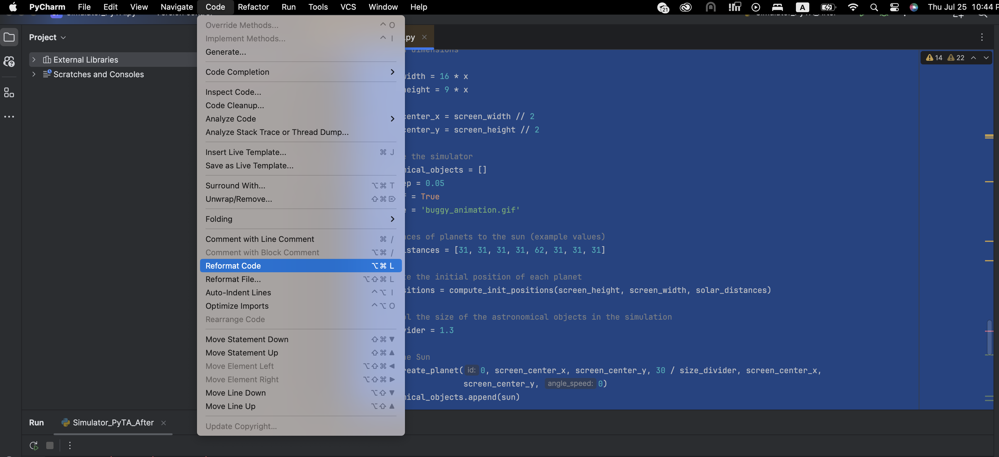

In this part of the practice, we will quickly go over the errors encountered when using PyTA. The objective is to familiarize you with PyTA and provide approaches to solving the errors you may face during the documentation of your code. Compared to the previous section, where we dealt with syntax and logical errors, this part is much more straightforward (most of the time).

To provide plenty of PyTA debugging exercises, we will document the whole simulator code instead of just our function. To start, run this [file](simulator_pyta_before.py). After executing it, a webpage consisting of the style problems will open, resembling the header above. On the left of the webpage, you can see a list of style errors by category. In the middle, all the styling errors are represented with explanations of what each error means. Let's start with the pep8-errors category.


At the top of the error category, you can find a link to a webpage that explains this error category. Furthermore, it is mentioned that there are 4 occurrences of the error in this category. The 4 errors are marked in the figure. For each error, you can see what the problem is. For example, in the first error, it says, "expected 2 blank lines, found 1." The highlighted yellow part of the error is where the problem occurs. You can also see a fix suggestion from PyTA written as `# INSERT NEW BLANK LINE HERE`. To solve this problem, we basically need to press enter on line 10, which adds a blank line. Note that sometimes, if you are unfamiliar with the error format, you may not understand the error well. For example, error 3 says, "block comment should start with '# '." While it seems that our block comment is starting with `#`, we are missing the space after the hash symbol!


One way to quickly fix multiple PEP8 style errors is to use the reformat feature of PyCharm. To reformat the code, select the section of the code that you want to fix for style. Then go to Code -> Reformat Code, and it will fix some of the PEP8 problems with the default setup in PyCharm.



After using reformat, let's run PyTA to see what errors are left! We still see a good number of PEP8 problems! For example, there are 17 occurrences of the `line-too-long` category.


The error is basically what it says it is! We have long lines of code, which makes it hard to read the code! We can go through each of these occurrences and ensure that the lines are less than 80 characters by creating new lines, or we can make our life easier by making PyCharm do this for us. To set the maximum line length to 80, we first need to go to PyCharm settings. For Apple, we can open this menu as shown below.


Since what we want to do is more about visualization, the "Editor" tab is where we need to go. So we go to "Editor -> Code Style" as shown below.


Now let's set the "Hard Wrap" variable to 80 and reformat the code again. You can see that the number of errors is now significantly lower. Let's continue with our style fixing routines!


We can indent this error, but I don't like the look of the "[" on line 101! So, let's change the code to this to solve the problem:

```python
for obj in objects:
    # Only draw orbits when there is an orbit
    if 'orbit_radius' in obj and obj['orbit_radius'] > 0:
        pygame.draw.circle(screen, (255, 255, 255),
                            (obj['center_x'], obj['center_y']),
                            obj['orbit_radius'], 1)
```

What a day! Let's check out other problems!


Here we can see that docstrings are not going to be fixed with the reformat option. While we can fix this with features such as "Fill Paragraph," we need to note that if we want to use the doctest capability, we can't change the line format as doctest only checks the characters of output with respect to input. This is basically one of the drawbacks of doctests. So let's fix the docstrings other than doctests. For example, in the following line, we can see that PyCharm lets us know which lines have a problem with an orange underline.


We can now fix the docstring by pressing enter after the word "given," or we can use the "Fill Paragraph" feature of PyCharm. Just hover your mouse over the text, and you will see something like this:


By clicking on the `Fill the paragraph`, PyCharm automatically fixes the long line.

Let's continue with the `redefined-builtin` category. This is actually a pretty dangerous error. It says that the input of `create_planet` `id` is a built-in function. While due to the scope of this function, it did not cause an error. However, if the code expands, it might end up in a very dangerous bug where the built-in function `id` is going to be used instead of our variable `id` or vice versa! So we need to immediately fix this. To fix this bug, I just change `id` to `idx` whenever I meant `id`.


Continuing our not-so-interesting but necessary style fixing journey, let's tackle the ```redefined-outer-name``` category. As tye error description indicates, the variables such as x is repeated on line 204.


Here is where the x is used in outerscope.


Here, we should change one of the occurrences of `x`. I chose to change the one related to `screen_width` and `screen_height` as I think it is more reasonable. The rest of these occurrences will be fixed in the same way.

Let's now address another category (I want to cry)! Well, the error is pretty straightforward. Let's make all constant variables `UPPER_CASE`.


And with this, we create a PEP8-friendly codebase. While it is tedious in the beginning, the more you code in a specific style, the more natural it becomes to code that way. Of course, in the long run, you will thank yourself for doing this chore as it will tremendously help you and others in expanding your codebase.