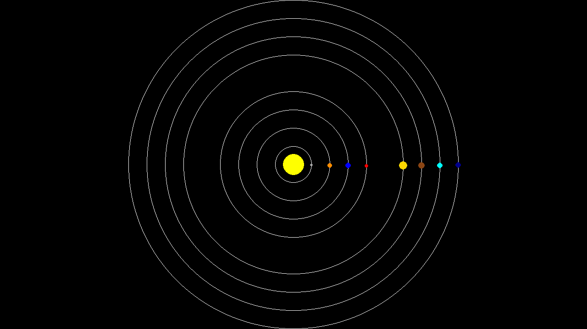

This section is divided into three parts:

1. **[Design](Design/README.md)**: In this part, we introduce the first problem that we want to solve and determine our approach using pen and paper design. The approximate reading time for this part is 10 minutes.

2. **[Implementation](Implementation/README.md)**: In this part, we implement our design. During the development process, we will encounter various problems and discuss the approaches taken to solve (debug) them. The reading time for this part is around 20 minutes.

3. **[Documentation and Style Check](PyTA/README.md)**: As this course is designed for CSC148, we aim to provide documentation in the required format for the course. We will finally check our formatting using the [PyTA](https://www.cs.toronto.edu/~david/pyta/usage/quick_start.html) module. The reading time for this part is 10 minutes.