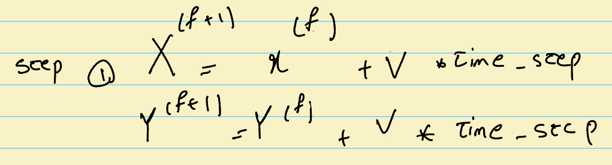
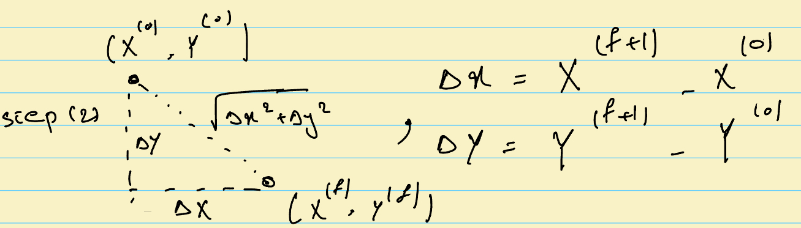

# Expanding Solar System!

## Objective

This is complementary material for Section 4 (Object-Oriented Programming) of the CSC148 course. Here, we want to explore why having classes and objects can be helpful and re-design our simulator with classes to be expandable and reusable. Here is our objective:

> Expand the solar system simulation by adding meteors to the simulator. A meteor is a tiny rock that starts to move at some place in space and disappears after moving a specific distance. For simplicity, assume the meteor moves in a straight line with a slope of 1. The speed of the meteor is fixed and equal in both directions ($V_x$, $V_y$) and it is between 20 to 60 pixels per second in each direction. You can also assume that meators that disapper randomly after traveling a user-defined distance, re-appear randomly on the screen with same characteristics!

Okay, this problem is a bit harder because we are asked to integrate a moving meteor into the simulation. Before anything, let's go through our initial pen and paper design. Here are the four characteristics of the meteors that we need to design: (I) It should appear randomly. (II) It moves at a slope of -1. (III) We also need to define a speed between 20 to 60 pixels per second, and (IV) it disappears and re-appear randomly after some user-defined distance.

But it is a simulation! How do these bodies of rock (meteor, planets, comets, etc.) move in a simulation? Well, let's quickly go through some preliminaries! The simulation above is just a series of pictures shown one after the other! As an example, I put the first 20 pictures of this simulation in this [Folder](Figure/Frames). Now, each of these pictures is also called a frame. If you have played games, bought a monitor, or heard about the features of the iPhone 13, you probably heard the term Frames Per Second (fps). It defines how many frames will be shown in a single second!

So we now know that a task of a simulator is to generate a bunch of frames and show them consecutively. For showing the frames consecutively, we use the [Pygame](https://github.com/pygame/pygame) module, and we won't go into its details. However, generating the frames is our work! For this simulation, we can see that if at each frame, we know the position of each of the planets, then we can quickly generate our frame by drawing a circle with a specific color at that position. The process is the same for our meteor! So all we need to do is find the positions, or (x,y) coordinates of each of the astronomical objects in our simulation space (that is, the screen)! Note that we were already helped with generating our first frame of the simulation in the previous section by finding the initial positions of our planets!

So now let's get back to our pen and paper design! How can we move the meteor on our screen? Let's start with an example: Imagine that you are on the 401 highway and you are driving at 10 m/s. If your car is at the beginning of the 401 highway, then after 1 second, it will travel 10 meters on that highway. If we assume the 401 is a line in the x direction, then the position of your car at the beginning is (0,0) and after 1 second it is (10,0). Basically, what you did intuitively in your mind to compute this position is to use $X=V_x * T + X_0$ where $X$ is the position that we want to compute, $V_x$ is your velocity or speed in the x direction, and $T$ is time. Finally, $X_0$ is your starting position. We can also consider moving between lanes as moving in the y direction! For example, if every 10 seconds we move one lane left starting from the right-most lane, then after 10 seconds, we are at (100, 1). That is, we moved 100 meters in the $X$ direction and we changed one lane in the $Y$ direction. So basically, our velocity or speed is $(V_x = 10 m/s, V_y = 0.1 m/s)$ assuming that each lane is about 1 meter wide.

For our meteor case, we follow the same procedure! Let's start with our pen and paper drawing! Before going to the detail, let's assume that there are some function avaiable that give us the random numbers that we want! That is random appearance, so let's assume that using those function, we have the starting point. As a result, we don't need to focus on (I). For (II) moving, here is my pen and paper design:

Here, f is the current frame and f+1 is the next frame. Here, I need to give a clarification, between fps and time_step. The fps is how many frames we are showing in 1 seconds. But time-step is variable (here we use a pre-defined variable by the simulator) that can depends on various things. For example in here, it is chosen so that planets move much faster around the sun (I don't want to wait for a whole year for one earth to orbit the sun!). 

Ok, now that we have the position, we also have to consider the (III) is also choosing a random speedup between 20 to 60 which we use the random number generator that we will use for (I). Finally, for (IV) which is disappearing condition, we use the following procedure:

Basically, we just need to know the beginning and the current position to compute the distance that a meteor moved so far. If it was more than the user-defined distance, then we reset the position of the meteor to another random place in screen. Ok, let's go to [Implement](../Implementation/README.md) this function!