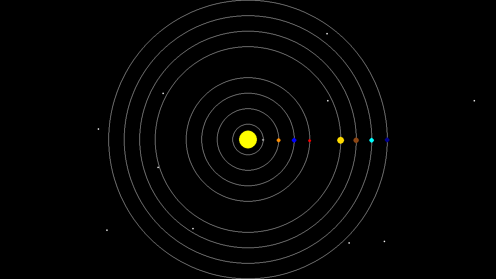

# Expanding Solar System - Part 1!

## Objective

For this section, we need to understand the structure of the given simulator code to be able to integrate the meteor into the code. Note that we do not need to understand every detail about the code that is given to us to work with. We first need to build a mental image of how the developers of the code thought about the process. When we have some abstract view, we can then think about ways to actually change the underlying code and expand it effectively. For the following read, I suggest to have the code [Simulator File](Function_Based_Before.py) also opened for easier read.

The way that I approach any unfamiliar code base, is to find the starting point! Looking at the ```if __name__ == "__main__":``` part of the [Simulator File](Function_Based_Before.py), we can quickly see where the procedure is going to start. Let's analyze this procedure together and think about how the developers of this code think about their simulator.

```python
if __name__ == "__main__":
    # Screen dimensions
    x = 80
    screen_width = 16 * x
    screen_height = 9 * x

    screen_center_x = screen_width // 2
    screen_center_y = screen_height // 2

    # Create the simulator
    astronomical_objects = []
    time_step = 0.05
    save_gif = True
    gif_name = 'animation.gif'

    # distances of planets to the sun (example values)
    solar_distances = [31, 31, 31, 31, 62, 31, 31, 31]

    # Compute the initial position of each planet
    init_positions = compute_init_positions(screen_height, screen_width, solar_distances)

    size_divider = 1.3

    # Add the Sun
    sun = create_planets(0, screen_center_x, screen_center_y, 30 // size_divider, 'circle', screen_center_x,
                          screen_center_y, 0, 0)
    astronomical_objects.append(sun)
```

Here using the comments, we can quickly see that the structure of this part is first some variables related to screen. There are also for variables related to the simulator. We then see solar_distances that we are families with followed by the function that we have developed. I currently don't know what is this size_divider, so we will leave it as that for now. We then see that a create_planets function exists that create a variable sun and this sun is stored in ```astronomical_objects``` list. Let's quickly see what is this create_planets function. If it is small, we can have clearer view.


```python
def create_planets(id, x, y, radius, shape, center_x=None, center_y=None, orbit_radius=None, angle_speed=None):
    return {
        'id': id,
        'x': x,
        'y': y,
        'radius': radius,
        'color': (255, 255, 255),  # Default white color
        'shape': shape,  # 'circle' or 'square'
        'center_x': center_x,
        'center_y': center_y,
        'orbit_radius': orbit_radius,
        'angle': math.atan2(y - center_y, x - center_x) if center_x is not None and center_y is not None else 0,
        'angle_speed': angle_speed
    }
```

Looking at the create_planets function, it returns a dictionary. The structure of the dictionary is also clear. So we know now that this simulator use a dictionary to store the information about each planet. Following back the computational pipeline, we will reach to this block of code.


```python
    # Add planets with their computed orbits
    planet_params = [
        (1, 0.02, 5),  # Mercury
        (2, 0.015, 7),  # Venus
        (3, 0.01, 8),  # Earth
        (4, 0.008, 6),  # Mars
        (5, 0.005, 12),  # Jupiter
        (6, 0.004, 10),  # Saturn
        (7, 0.003, 9),  # Uranus
        (8, 0.002, 8)  # Neptune
    ]

    speed_multiplier = 50

    for i, (planet_id, angle_speed, radius) in enumerate(planet_params):
        init_pos = init_positions[i]
        planet = create_planets(
            planet_id,
            init_pos[0],
            init_pos[1],
            radius // size_divider,
            'circle',
            screen_center_x,
            screen_center_y,
            init_pos[0] - screen_center_x,
            angle_speed * speed_multiplier
        )
        astronomical_objects.append(planet)

    # Run the simulation
    run_simulation(screen_width, screen_height, time_step, astronomical_objects, save_gif, gif_name)
```

TODO read the below, as I think there is no longer a "planets" dictionary here... astronomical_objects?

There is a ```planet_params``` which is used in the for loop. We also have ```speedup_multiplier``` which is used in the for loop to create the planets dictionary. So basically this for loop creates other planets and everything is feed to ```run_simulation``` function. We don't necessary have to understand ```speed_multiplier``` or ```planet_params``` as we only care about computational flow. Let's see how ```run_simulation``` function works. 


```python
def run_simulation(width, height, time_step, planets, save_gif=False, gif_name='simulation.gif'):
    screen, clock = init_pygame(width, height)
    frames = []
    running = True
    while running:
        for event in pygame.event.get():
            if event.type == pygame.QUIT:
                running = False

        # Move planets
        for planet in planets:
            move_planet(planet, time_step)

        for planet in planets:
            update_color(planet)

        # Draw everything
        draw(screen, planets)

        # Capture frame for GIF
        if save_gif:
            frame = pygame.surfarray.array3d(screen)
            frame = np.transpose(frame, (1, 0, 2))
            frames.append(frame)

        # Update the display
        pygame.display.flip()
        clock.tick(60)

    # Save the GIF
    if save_gif:
        imageio.mimsave(gif_name, frames, fps=30, loop=0)

    pygame.quit()
    sys.exit()
```

Let's remind ourselves of what we are searching for. We want to understand the structure of the simulator code enough so that we can integrate our meteors into it. So far, we realize that the meteors should be represented as dictionaries, similar to how planets are. Now, in this `run_simulation`, we should follow the lines that relate to the planets input. Let's continue analyzing the code.

In this function, there is `init_pygame`, whose purpose I don't yet understand. Then, there is a `while running` loop which is always True, so it is probably something that allows us to run the simulation indefinitely. There is an if statement that checks events and has `running=False`. I don't know what it is doing, but if the `if` statement is true, then the `while` loop stops. Then we have `move_planets`, `update_colors`, and `draw_function`, which directly interact with the planets dictionary. Finally, there are some options such as `save_gif` that, since they are not interacting with the `move_planet`, are not important (at least for now, based on our first pass on the code).

Let's check the three functions that we care about.

```python
def move_planet(planet, time_step):
    if planet['orbit_radius'] is not None:
        planet['angle'] += planet['angle_speed'] * time_step
        planet['x'] = planet['center_x'] + planet['orbit_radius'] * math.cos(planet['angle'])
        planet['y'] = planet['center_y'] + planet['orbit_radius'] * math.sin(planet['angle'])
```

The above function updates the ```x``` and ```y``` coordinates. The ```angle``` is also computed to be used for computing the ```x``` and ```y```. So it seems that the fields ```x``` and ```y``` are important to have a correct simulation!

```python
def update_color(planet):
    colors = [
        (255, 255, 0),  # Sun (Yellow)
        (169, 169, 169),  # Mercury (Grey)
        (255, 140, 0),  # Venus (Orange)
        (0, 0, 255),  # Earth (Blue)
        (255, 0, 0),  # Mars (Red)
        (255, 215, 0),  # Jupiter (Golden)
        (139, 69, 19),  # Saturn (Brown)
        (0, 255, 255),  # Uranus (Cyan)
        (0, 0, 139)  # Neptune (Dark Blue)
    ]
    planet['color'] = colors[planet['id']] if planet['id'] < len(colors) else (255, 255, 255)
```
It seems that the above function define the color of each planet and if the id is not correct, then it will assign a default value. In here, we can see that planet['color'] is also important field in this dictionary!

```python
def draw(screen, planets):
    screen.fill((0, 0, 0))  # Fill the screen with black
    for planet in planets:
        if planet['orbit_radius'] > 0:  # Only draw orbits for planets with a non-zero orbit radius
            pygame.draw.circle(screen, (255, 255, 255), (planet['center_x'], planet['center_y']),
                               planet['orbit_radius'], 1)
    for planet in planets:
        if planet['shape'] == 'circle':
            pygame.draw.circle(screen, planet['color'], (int(planet['x']), int(planet['y'])), planet['radius'])
        else:
            raise ValueError("Invalid planet shape")
```

Finally, the draw function seems to create the frame that we were taking about. It starts with defining the black background as the comment mentions, then it draws the circles that the planets are moving on. Finally, in the last for-loop, this function draws circles and if the planet shape is not circle it raises an error. We can also see that to draw a planet, 4 keys of the dictionary are directly used: ```planet['color'], planet['x'], planet['y'], planet['radius']```. We also observe that having ```planet['shape']``` is also important for the if-statement. If we would like to understand the inputs of ```pygame.draw.circle```, we can also have a quick look at its documentation [here](https://www.pygame.org/docs/ref/draw.html#pygame.draw.circle). 

Let's pause here for a moment and analyze our observation. The logic of the code is somewhat understandable because of the documentation and naming of the variables. This means that we also really need to think about how we want to write our code if we want someone else to later work with our code and expand it, so that they don't suffer! We can also observe that it is tricky to expand this code, because there is no rule or documentation that forces us to create another dictionary with these 4 specific key values. This can make the expansion very hard! But don't worry, we will eventually get to the answer as I am the one who developed the code! But is it true for real-world applications out there? Do you have the developer of the code by your side all the time?

TODO expansion is maybe not the right word... we often talk about extending code, so maybe go with extension instead?

Let's start the expansion. While there are many ways to add meteors to this simulation, such as adding a `meteor_list` to the `run_simulation` function and writing the three functions (`update_color`, `move_planet`, `draw`) for the meteor, I prefer to use the already existing `astronomical_objects` list to add the meteors. Note how everything is up to my choice. There is nothing to control my decisions. So if someone else works on, for example, adding a comet, they need to understand how I am expanding the `run_simulation`. Otherwise, if they are late and I commit my code first, they will have to change their code to work with my `run_simulation`. As you can see, this approach can hinder collaborative work on a code base. But let's continue!


Based on our design principle [Design](../../Design/README.md) and the code requirement, I chose to create the following function. Note that another person can come up with totaly different and valid dictionary that still works, but I choose this dictionary.

```python
def create_meteor(id: int, x: float, y: float, radius: float, shape: str, speed: float) -> dict:
    """Return a meteor dictionary with the given parameters
    >>> create_meteor(1, 100, 100, 3, 'circle', 2)
    {'id': 1, 'x': 100, 'y': 100, 'delta_x': 0, 'delta_y': 0, 'radius': 3, 'color': (255, 255, 255), 'shape': 'circle', 'speed': 2, 'distance_traveled': 0}

    Preconditions:
      - radius > 0
      - speed > 0
      - shape == 'circle'
    """
    return {
        'id': id,
        'x': x,
        'y': y,
        'delta_x': 0,
        'delta_y': 0,
        'radius': radius,
        'color': (255, 255, 255),  # Default white color
        'shape': shape,  # 'circle' or 'square'
        'speed': speed,
        'distance_traveled': 0
    }
```


Now using this function, we can create a number of meteors and add it to the code.  
```python
for id in range(10,20):
    meteor = create_meteor(id, random.uniform(0, screen_width),
                            random.uniform(0, screen_height),
                            2, 'circle', random.uniform(20, 60))
    astronomical_objects.append(meteor)
```
Let me explain the above block of code in more detail. I chose the IDs to start from 10 so that they follow the IDs for planets. This is because I will update the `update_color` function to work with IDs for meteors. Furthermore, I use the `random.uniform(i, j)` function from the `random` module to pick a random number in the range of `i` to `j`. As a result, the meteors' starting positions are somewhere on the screen with speeds between `20` and `60`. Consider this function as a way to pick any number between 20 and 60 with equal probability. This means the chance that this function returns 22 is equal to the chance it returns 50. You will learn about different distributions if you take a statistics course. Finally, I chose to have 10 meteors, so the range is between 10 and 20. Now, let's change the ```run_simulation``` function to work with our meteor!


With the following definition of meteor, I don't have to change the ```draw``` and ```update_color``` function if the default color is fine. (Excercise. You can see the code and see why we don't need to change those functions). However, the planets move is circular while meteors move in a straight line. So we need to change the below block of code in ```run_simulation``` function to work with for meteor.

```python
        for planet in planets:
            move_planet(planet, time_step)
```

First, I need to define a move_meteor function. Here is what I have wrote based on [Design](../../Design/README.md) section.

```python
def move_meteor(meteor, time_step, screen_width, screen_height, max_distance=500):
    """Move a meteor in a straight line and handle fading/reappearing

    Preconditions:
      - meteor['x'] != None
      - meteor['y'] != None
      - meteor['speed'] > 0
      - time_step > 0
      - max_distance > 0
    """
    x_displacement = meteor['speed'] * time_step
    y_displacement = meteor['speed'] * time_step
    meteor['x'] += x_displacement
    meteor['y'] += y_displacement
    meteor['delta_x'] += x_displacement
    meteor['delta_y'] += y_displacement
    meteor['distance_traveled'] += math.sqrt(
        meteor['delta_x'] * meteor['delta_x'] + meteor['delta_y'] * meteor['delta_y']) * time_step

    # Check if the meteor has traveled beyond the maximum distance
    if meteor['distance_traveled'] >= max_distance:
        # Reset the distance traveled
        meteor['distance_traveled'] = 0
        # Randomly reposition the meteor
        meteor['x'] = random.uniform(0, screen_width)
        meteor['y'] = random.uniform(0, screen_height)

```

The above is the function that I wrote based on pen-and-paper steps. As an exercise, you can check whether it is correct or write your own version of this code. Note that there are other ways to implement this function too.

Now let's integrate the function into `run_simulation`. I wrote something like this:

```python
# Move objects
for obj in objects:
    if 'orbit_radius' in obj:
        move_planet(obj, time_step)
    elif 'speed' in obj:
        move_meteor(obj, time_step, width, height, random.uniform(500, 1000))
```

As you may notice, the code is becoming more unreasonable. The choices are now becoming really subjective. For example, I didn't have any way to distinguish between meteors and planets, so I used a key inside the planet dictionary that is not inside the meteor dictionary and a key inside the meteor dictionary that is not inside the planet dictionary to distinguish them. You can immediately see how error-prone this is. We can for example add a `type` key to the dictionaries of planets and meteors, or use a different approach, but we are not forced to do so. Furthermore, if we are part of a bigger project, we may as well choose something that is not compatible with other objectives in the team. For example, note that if a third person sees the `type` variable, they may think that their implementation does not need the `type` input, as by not having it, they can distinguish, for example, a comet from a meteor and a planet. Note that eventually, we manage to finish this task. But is this sustainable?

Here is the question: while we did manage to develop the requirement for this simulation, what if we continue extending the functionality of this code? What if our design decisions are so bad that we face many of these unreasonable `if else` statements? Can we also reuse any part of this code? For example, can we provide a compact interface for other simulators to use our meteor code? Can we work with a collaborator on this code and add multiple features at the same time? With the current structure, it would be really unpleasant to do this kind of work, and that is why programming languages such as Python provide object-oriented programming by defining classes and objects.

In [Part 2](../Part1/README.md), we will first refactor our simulator and its input to include some classes, and we will see how using object-oriented programming can make a big difference in the readability and expansion of the code.
