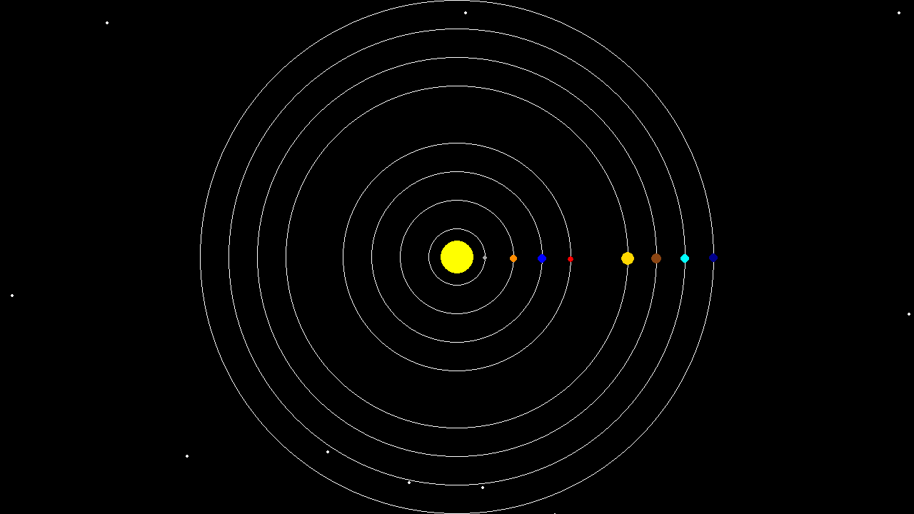
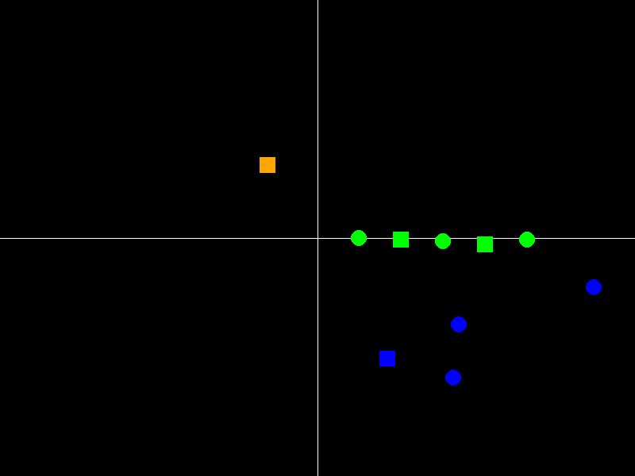

# Expanding Solar System - Part 2!

## Objective

To understand the benfits of object oriented programming. We will go through the same process of integrating our meteor code into the simulator. But this time, the simulator is given to us as set of classes. The [Simulator File](Class_Based_Before.py) contains the whole simulator with set of 3 classes. Due to the use of class, we are asked to add the meteor feature same as the one explained in [Design](../../Design/README.md) but with following implementation restriction. 

> To impelement the meteor feature to the simulation, please instantiate a class from ```AstronomicalBodies``` base class an implement the required methods.

Let's first see the ```AstronomicalBodies``` class. Note that because of the documentation in the class description, variables and methods objectives are self explanotary. However, if it is not sufficient, please review the [Part 1](../Part1/README.md).

```python
class AstronomicalBody:
    def __init__(self, id: int, x: float, y: float, radius: float, type: str):
        self.id = id  # body identifier
        self.x = x  # x position in 2D space
        self.y = y  # y position in 2D space
        self.radius = radius  # the radius of the body (assuming it's a circle)
        self.color = (255, 255, 255)  # Default white color
        self.type = type  # 'planet', star, etc

    def move(self, time_step):
        """
        Move the body in the 2D space
        """
        ValueError("This method should be implemented in the subclass", self.get_type())

    def get_color(self):
        """
        Get the color of the body
        """
        return self.color

    def get_type(self):
        """
        Get the type of the body
        """
        return self.type
```

Let's also visit the ```if __name__ == "__main__":``` part of the code.
```python
if __name__ == "__main__":
    x = 80
    screen_width = 16 * x
    screen_height = 9 * x

    screen_center_x = screen_width // 2
    screen_center_y = screen_height // 2

    astronomical_objects = []
    time_step = 0.05
    save_gif = True
    gif_name = 'animation.gif'

    solar_distances = [31, 31, 31, 31, 62, 31, 31, 31]
    init_positions = compute_init_positions(screen_height, screen_width, solar_distances)

    size_divider = 1.3

    sun = Star(0, screen_center_x, screen_center_y, 30 // size_divider, 'star')
    astronomical_objects.append(sun)

    planet_params = [
        (0, 0.02, 5),  # Mercury
        (1, 0.015, 7),  # Venus
        (2, 0.01, 8),  # Earth
        (3, 0.008, 6),  # Mars
        (4, 0.005, 12),  # Jupiter
        (5, 0.004, 10),  # Saturn
        (6, 0.003, 9),  # Uranus
        (7, 0.002, 8)  # Neptune
    ]

    speed_multiplier = 50

    for i, (planet_id, angle_speed, radius) in enumerate(planet_params):
        init_pos = init_positions[i]
        planet = Planet(
            planet_id,
            init_pos[0],
            init_pos[1],
            radius // size_divider,
            'planet',
            screen_center_x,
            screen_center_y,
            init_pos[0] - screen_center_x,
            angle_speed * speed_multiplier
        )
        astronomical_objects.append(planet)

    simulator = Simulator(screen_width, screen_height, time_step, astronomical_objects, save_gif, gif_name)
    simulator.run()
```
Everything is pretty much the same. As planets and sun objects are added to astronomical_objects list, we also need to add our meteor class (after definition) to this list. Let's just do that.

```python
class Meteor(AstronomicalBody):
    def __init__(self, id: int, x: float, y: float, radius: float, type: str, speed: float, max_distance: float):
        super().__init__(id, x, y, radius, type)
        self.speed = speed
        self.max_distance = max_distance
        self.delta_x = 0
        self.delta_y = 0
        self.traveled_distance = 0

    def move(self, time_step: float):
        x_displacement = self.speed * time_step
        y_displacement = self.speed * time_step
        self.x += x_displacement
        self.y += y_displacement
        self.delta_x += x_displacement
        self.delta_y += y_displacement
        self.traveled_distance += math.sqrt(
            self.delta_x * self.delta_x + self.delta_y * self.delta_y) * time_step

        # Check if the meteor has traveled beyond the maximum distance
        if self.traveled_distance >= self.max_distance:
            # Reset the distance traveled
            self.traveled_distance = 0
            # Randomly reposition the meteor
            self.x = random.uniform(0, screen_width)
            self.y = random.uniform(0, screen_height)
```

Above is the class that I defined for adding the Meteor. As you can see, it inherits from AstronomicalBody base class and we implement the required method ```move``` with the identical logic that we used for our [function based](../Part1/Function_Based.py) simulator. Let's add this to the ```astronomical_objects``` list.

```python
# Add meteors
for id in range(0, 10):
    meteor = Meteor(id, random.uniform(0, screen_width),
                    random.uniform(0, screen_height),
                    2, 'Meteor', random.uniform(20, 60), random.uniform(500, 1000))
    astronomical_objects.append(meteor)
```

Here, I also didn't want to hack how the color of meteor is going to be set with id, so I start with 0 to 10 ids for the meteors. Now without knowing the simulator code base, let's run this code with the added ```Meteor``` class. 



Well, it works! Let's pause for a moment and enjoy the cleanness of this procedure! 

Ok, so let's get back and analyze why it is so good! First, note that the base class informed us of necessary variables and methods that we should define! So no more guessing! We don't need to read and understand simulator code base and add our personal preferences to different parts of the code. Also, note that our collaborator can also focus on coding their "Comet" object without worrying about the design decisions that we are making. 


Reading [Part 1](../Part1/README.md) and current part, we can also see how the developers of simulator code base thought about ```AstronomicalBody``` base class and simulator class. However, in practice, if we want to add feature to different part of the code, a collaboration between developers is necessary as adding some features may require adding new codes to other classes. For example, the planet is the only object in here that its path is shown by a line which shows that the developer of planet needed to discuss this feature with the developer of simulator class. 

For completeness, let's also see how the simulator class works!

```python
class Simulator:
    def __init__(self, width, height, time_step, astronomical_bodies, save_gif=False, gif_name='simulation.gif'):
        self.width = width
        self.height = height
        self.time_step = time_step
        self.astronomical_bodies = astronomical_bodies
        self.save_gif = save_gif
        self.gif_name = gif_name
        self.frames = []

    def init_pygame(self):
        pygame.init()
        self.screen = pygame.display.set_mode((self.width, self.height))
        self.clock = pygame.time.Clock()

    def draw(self):
        self.screen.fill((0, 0, 0))  # Fill the screen with black
        for body in self.astronomical_bodies:
            if body.get_type() == 'planet':
                pygame.draw.circle(self.screen, (255, 255, 255), (body.center_x, body.center_y),
                                   body.orbit_radius, 1)

            pygame.draw.circle(self.screen, body.get_color(), (int(body.x), int(body.y)), body.radius)

    def run(self):
        self.init_pygame()
        running = True
        while running:
            for event in pygame.event.get():
                if event.type == pygame.QUIT:
                    running = False

            for body in self.astronomical_bodies:
                body.move(self.time_step)

            self.draw()

            if self.save_gif:
                frame = pygame.surfarray.array3d(self.screen)
                frame = np.transpose(frame, (1, 0, 2))
                self.frames.append(frame)

            pygame.display.flip()
            self.clock.tick(60)

        if self.save_gif:
            imageio.mimsave(self.gif_name, self.frames, fps=30, loop=0)

        pygame.quit()
        sys.exit()
```

The reasoning behind ```run``` method is the same is ```run_simulation``` method. We can also see that we have all the simulation specific variables in the ```Simulator``` class which makes the code more structured. Now the moving part of the reasoning is simply as below:

```python
for body in self.astronomical_bodies:
    body.move(self.time_step)
```
While ```move``` method from ```AstronomicalBody``` class is called for each object, depending on the type of the objects (star, meteor, planet), the specific move method will be called. This will allow for different objects have their own way of moving, but same interface for calling the ```move``` method.

In ```draw``` method we can also see the same reasoning. However, due to the requirement of seeing the trail of ```Planet``` objects, the simulator code has a routin for this specific objects which shows that collaboration between developers are someties necessary.

Now as an exercise and using the code bases that we have so far, see whether you can create a particle simulator like below. This exercise will show you the reusibility of the class based code that we have compared to the function based code! The solution for this exercise is in here. But, I strongly suggest you to try to do it yourself as you have all the necessary knowledge to develop this. Enjoy!



Finally note that we just scratched the surface! It is not always true that having objects and class for everything is beneficial. The life is about balance after all! So be careful about the complexity and efficiency of your code when developing.


