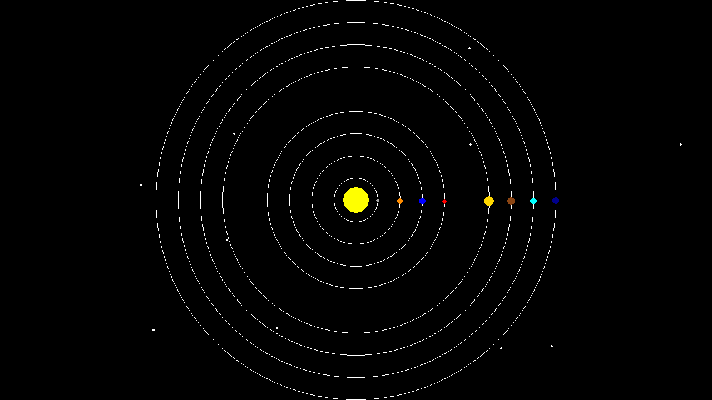

# Expanding Solar System!

## Objective

Now that we've sketched a simple process for solving the problem defined in the [Design Section](../Design/README.md), we need to start converting those thoughts into code! However, this time we also need to know how our code will be integrated into the simulator pipeline. To see the benefits of object-oriented programming, we will do this process in two parts. First, we will integrate our meteor into our function-based simulator, meaning there will be no class definitions in our file. Then, we will go through the same process but using object-oriented programming and a simulator that uses classes. This process will show us how object-oriented programming can make our lives easier.

- [Part 1](Part1/README.md)
- [Part 2](Part2/README.md)
