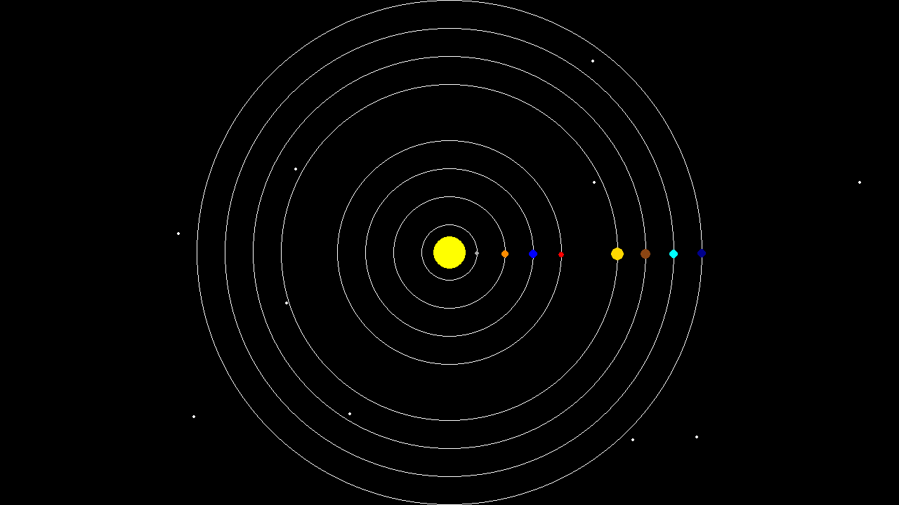

This section is divided into three parts:

1. **[Design](Design/README.md)**: In this section, we aim to integrate the meteor (the white objects that appear and disappear) into our simulator. To design this feature, some preliminaries are required. After introducing those preliminaries, we will do our pen and paper design. While it may seem intimidating at first, we will walk you through each step. Trust me, it is going to be fun and not as scary as it seems! The reading time for this part is around 10 minutes.

2. **[Implementation](Implementation/README.md)**: In this part, we implement our design. To provide intuition on the difference between class-based programming and function-based programming, we will implement our design in both a function-based simulator and a class-based simulator. This part will be fun! The approximate reading time for both parts is around 30 minutes.

3. **[Unit Test]()**: 