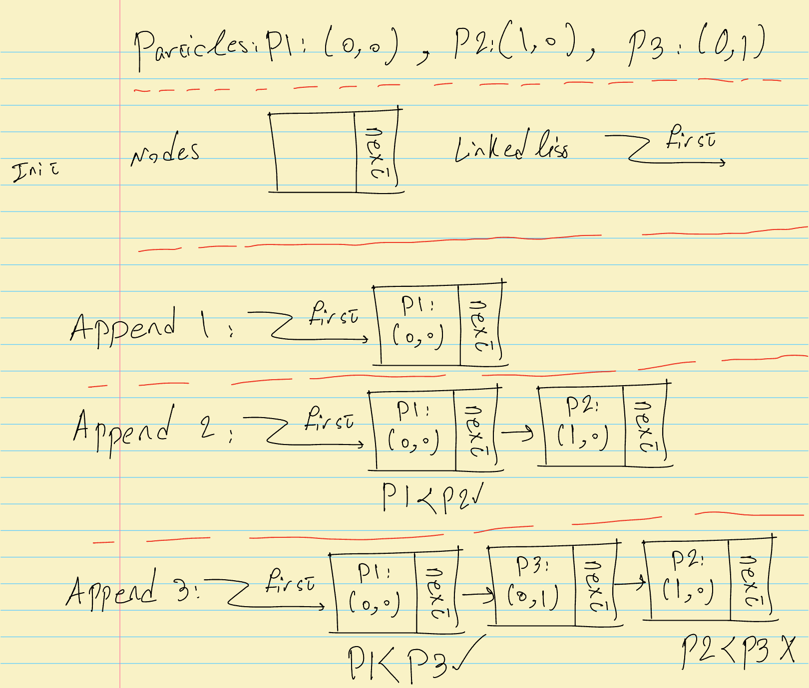

# Expanding Solar System!

## Objective

This is complementary material for Section 6 (Linked lists) of the CSC148 course. Here, we aim to design and implement a simple particle simulator where particles are added and removed from the screen as shown above. Detailed instructions are provided below.

> To achieve the simulation, particle objects are required to be stored in nodes of an ordered linked list. The order allows for fast removal of the particles. For example, particles with coordinates (0,0), (1,0), and (0,1) are ordered as (0,0), (0,1), and (1,0). To compare particles, we first order based on the x-coordinate and then the y-coordinate if the x-coordinates are equal. In this [file](../link_list_before.py), templates for three classes: ```Particle```, ```_Node```, and ```LinkedList``` are provided. Complete these classes based on the given objective.

Note that in reality, you would likely choose your own data structure to achieve the objective. However, this is complementary material for a course, so we are restricted to using a specific data structure, LinkedList, to learn it. Also, the templates we will soon see are derived from the course notes, which are a very good starting point.

Unlike previous sections, our Design section involves looking at the code a bit. Note that no one said you should not glance at the code for your initial design. At the end of the day, it is an iterative process where you design and implement until you achieve the desired result. Now let's look at the templates that we are required to complete (see the course notes for a detailed explanation of this template).

This is the Particle template:
```python
class Particle:
    def __init__(self, x, y, radius):
        self.x = x
        self.y = y
        self.radius = radius
```

The particles are stored as items in ```_Node``` objects.

```python
class _Node:
    """A node in a linked list.

    Note that this is considered a "private class", one which is only meant
    to be used in this module by the LinkedList class, but not by client code.

    Attributes:
    - item:
        The data stored in this node.
    - next:
        The next node in the list, or None if there are no more nodes.
    """
    item: Any
    next: '_Node | None'  # Fix type annotation

    def __init__(self, item: Any) -> None:
        """Initialize a new node storing <item>, with no next node.
        """
        self.item = item
        self.next = None  # Initially pointing to nothing
```

This is the LinkedList template, which shows a connection of ```_Node``` objects. It also provides methods to interact with this chain of nodes.

```python
class LinkedList:
    """A linked list implementation of the List ADT.

    Private Attributes:
    - _first: The first node in this linked list, or None if this list is empty.
    """
    _first: '_Node | None'

    def __init__(self) -> None:
        """Initialize an empty linked list.
        """
        self._first = None

    def append(self, item: Any) -> None:
        """Add the given item to the linked list while maintaining order."""
        pass

    def get(self, index: int) -> Any:
        """Return the item of a Node at position <index> in this linked list.
        """
        pass

    def pop(self, index: int) -> Any:
        """Remove the node and return the item at position <index>.
        """
        pass
```

As we saw in [Implementation - Part 2](../../Section2/Implementation/Part2/) of Section 2, with object-oriented programming, we mostly do not need to know the details of how the simulator works. Thus, we can understand what we need to implement by focusing on these three classes. However, if you want to know more details, you can see the ```Simulator``` class, which is a simplified version of the ```Simulator``` class from previous sections.

Let's talk about the methods that this LinkedList performs. Based on the code and task definition, each particle is going to be placed inside a ```_Node``` class as an item using ```append```, resulting in the formation of an ordered linked list. We also need to provide ```get``` and ```pop``` methods. Both ```pop``` and ```get``` return the item inside a node, but ```pop``` removes the corresponding node.

Based on this explanation, let's see what will happen to the linked list if we add three particles with coordinates (0,0), (1,0), and (0,1) to the linked list and then remove them.

