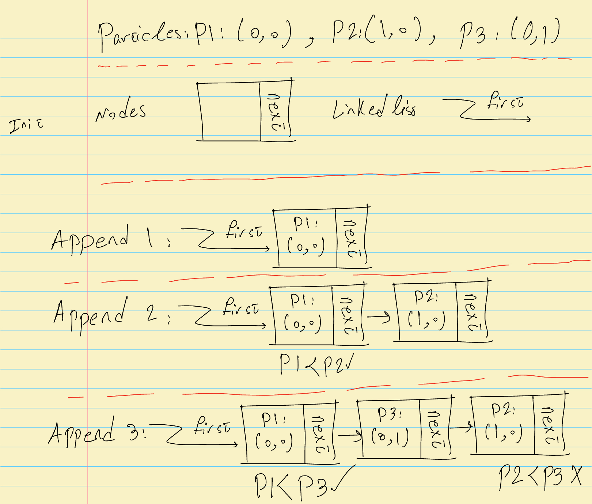
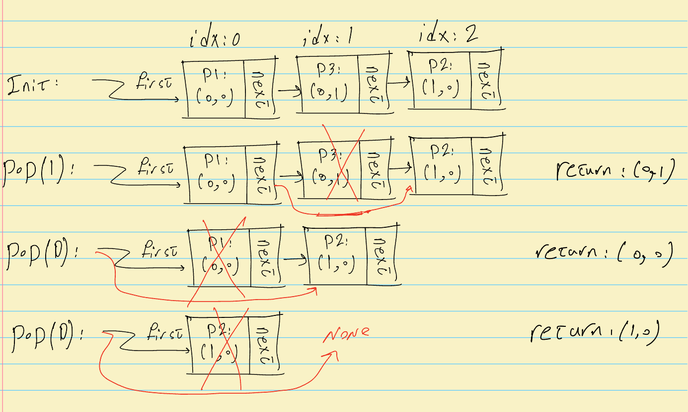

# LinkedList Usage in Particle Simulation - Design!

## Objective

This is complementary material for Section 6 (Linked Lists) of the CSC148 course. Here, we're going to design and implement a simple particle simulator where particles are added to and removed from the screen, as shown above. Detailed instructions are provided below.

> To achieve the simulation, particle objects need to be stored in the nodes of an ordered linked list. The order allows for fast removal of the particles. For example, particles with coordinates (0,0), (1,0), and (0,1) are ordered as (0,0), (0,1), and (1,0). To compare particles, we first order based on the x-coordinate and then the y-coordinate if the x-coordinates are equal. In this [file](../link_list_before.py), templates for three classes: `Particle`, `_Node`, and `LinkedList` are provided. Complete these classes based on the given objective.

Now, in a real-world scenario, you might choose a different data structure to achieve this goal. But since this is complementary material for a course, we’re sticking with LinkedLists to get familiar with how they work. The templates we’ll be working with are derived from the course notes, which are a great starting point.

Unlike in previous sections, our Design section will involve a bit of code examination. Don’t worry—no one said you shouldn’t peek at the code during the design phase. After all, design and implementation are iterative processes, and sometimes you’ll need to go back and forth until everything clicks. So, let’s take a look at the templates we need to complete (refer to the course notes for a detailed explanation of this template).

Here’s the Particle template:

```python
class Particle:
    def __init__(self, x, y, radius):
        self.x = x
        self.y = y
        self.radius = radius
```

The particles will be stored as items in `_Node` objects.

```python
class _Node:
    """A node in a linked list.

    Note that this is considered a "private class", one which is only meant
    to be used in this module by the LinkedList class, but not by client code.

    Attributes:
    - item:
        The data stored in this node.
    - next:
        The next node in the list, or None if there are no more nodes.
    """
    item: Any
    next: '_Node | None'  # Fix type annotation

    def __init__(self, item: Any) -> None:
        """Initialize a new node storing <item>, with no next node."""
        self.item = item
        self.next = None  # Initially pointing to nothing
```

And here’s the LinkedList template, which shows how `_Node` objects are connected. It also provides methods to interact with this chain of nodes.

```python
class LinkedList:
    """A linked list implementation of the List ADT.

    Private Attributes:
    - _first: The first node in this linked list, or None if this list is empty.
    """
    _first: '_Node | None'

    def __init__(self) -> None:
        """Initialize an empty linked list."""
        self._first = None
        self.size = 0

    def append(self, item: Any) -> None:
        """Add the given item to the linked list while maintaining order."""
        pass

    def get(self, index: int) -> Any:
        """Return the item of a Node at position <index> in this linked list."""
        pass

    def pop(self, index: int) -> Any:
        """Remove the node and return the item at position <index>."""
        pass
```

As we saw in [Implementation - Part 2](../../Section2/Implementation/Part2/) of Section 2, with object-oriented programming, you often don’t need to know every detail of how the simulator works. You can focus on these three classes to understand what needs to be implemented. However, if you’re curious about the inner workings, feel free to review the `Simulator` class, which is a simplified version of the one from earlier sections.

Now, let’s talk about the methods this LinkedList performs. Based on the code and task definition, each particle will be placed inside a `_Node` as an item using `append`, forming an ordered linked list. We’ll also need to provide `get` and `pop` methods. Both `pop` and `get` return the item inside a node, but `pop` also removes the corresponding node.

With that in mind, let’s see what happens to the linked list when we add three particles with coordinates (0,0), (1,0), and (0,1).



If we outline the steps involved in adding nodes to the linked list, they look like this:

1. Create the node.
2. Find the correct place for the node by comparing it to other nodes in the linked list.
3. Place the node in its correct position and assign the appropriate pointers, such as `first` or `next`.

Now, let’s also examine the removal process.



Here are the steps involved in a pop process:

1. Find the node based on the index.
2. Delete the node and adjust the appropriate `next` or `first` pointers.
3. Return the item inside the node.

Based on this design, the `get` method is essentially a simpler version of `pop` where we don’t delete anything. With that intuition in mind, let’s start coding in the [Implementation](../Implementation/README.md) section.