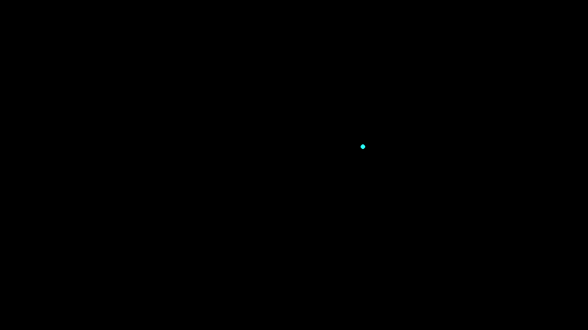
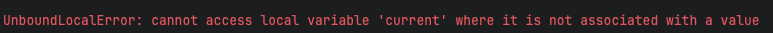
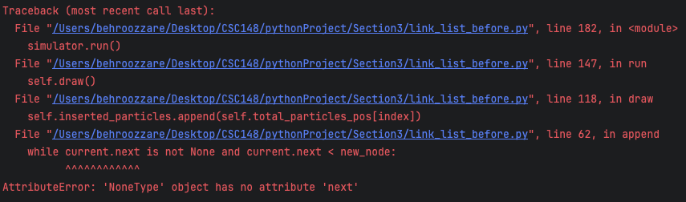
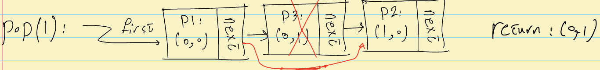
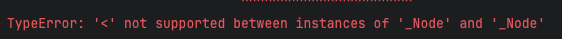
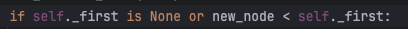
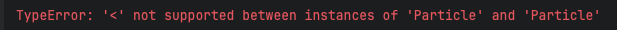

# LinkedList Usage in Particle Simulation - Implementation!

## Objective

In this section, we'll finish up the classes we talked about in the [Design](../Design/README.md) part of this tutorial. Use the [Starter Code](../starter_code.py) for this section development. Let's dive into the implementation of the `append` method. Remember, the steps we designed are as follows:

1. Create the node.
2. Find the correct place for the node by comparing it to other nodes in the linked list.
3. Place the node in its correct position and assign appropriate pointers, such as `first` or `next`.

Let's start with the first step:

```python
def append(self, item: Any) -> None:
    """Add the given item to the linked list while maintaining order."""
    new_node = _Node(item)
```

Next, to find the correct place and compare nodes, we need a way to iterate over the nodes in the linked list. A common way to do this looks like this:

```python
while current.next is not None:
    current = current.next
```

Take a moment to think about why these two lines allow us to iterate over all the elements of a linked list. Unlike arrays, accessing a node at the end of a long linked list means we have to go through all the previous nodes. That’s why operations that involve these lines are slower compared to arrays. You’ll learn more about this in other courses when we get into complexity.

Back to our `append` method! Now that we can iterate over all the nodes, we need to compare them to find the "correct place" for our new node. Here’s how we can implement that:

```python
def append(self, item: Any) -> None:
    """Add the given item to the linked list while maintaining order."""
    new_node = _Node(item)
    while current.next is not None and current.next < new_node:
        current = current.next
    new_node.next = current.next
    current.next = new_node
    self.size += 1
```

If we add this code and run the [starter code](../link_list_before.py) with the updated `append` method, we’ll hit the following error:



This is a common mistake—forgetting to initialize a variable. Here, `current` doesn’t have an initial value, so the `while` loop doesn’t know where to start. To fix this, we can initialize the `current` variable to `_first`. Depending on your design, you might start from a different part of the linked list, but for now, let’s add this line before the `while` loop and run the code.

```python
current = _first
```

Running this will give us another error:



Let’s focus on the last line of the error: `AttributeError: 'NoneType' object has no attribute 'next'`. The issue here is that `_first` is initially defined as `None` in the `__init__(self)` method of the `LinkedList` class. As the [Design](../Design/README.md) section explains, `_first` doesn’t point to anything at the beginning. This means we need to handle the special case of adding the very first node differently. Here’s how I fixed this initialization issue:

```python
def append(self, item: Any) -> None:
    """Add the given item to the linked list while maintaining order."""
    new_node = _Node(item)
    if self._first is None or new_node < self._first:
        new_node.next = self._first
        self._first = new_node
    else:
        current = self._first
        while current.next is not None and current.next < new_node:
            current = current.next
        new_node.next = current.next
        current.next = new_node
    self.size += 1
```

And that’s it for the `append` method! Now let’s move on to the `get` and `pop` methods.

The `get` method just needs to iterate over the nodes and return the item in the node at the specified index. Here’s how you can implement it:

```python
def get(self, index: int) -> Any:
    """Return the item at position <index> in this linked list.

    Preconditions:
        - index >= 0
        - index < self.size
    """
    if index >= self.size or index < 0:
        raise IndexError("Index out of bounds")
    current = self._first
    for _ in range(index):
        current = current.next
    return current.item
```

The first couple of lines check if the index is valid. It’s always a good idea to have these checks in place. For this course, you can include these checks as `Preconditions` in the docstring, as shown here. However, in other places, make sure you have some form of validation, like the one above. Now, let’s implement the `pop` method.

Let’s start with a general node (not the boundary cases where the node being popped is the first or last one). First, let’s remind ourselves of the steps involved in popping a node:

1. Find the node based on the index.
2. Delete the node and adjust the appropriate `next` or `first` pointers.
3. Return the item inside the node.

The first and third steps are pretty straightforward based on the `get` method. However, the second step can be a bit tricky. How do we adjust the `next` or `first` pointers? Let’s revisit one of the examples in our [Design](../Design/README.md) procedure:



Here, the node at index 1 is popped from the linked list. We can see that the `next` pointer of the node before the one being popped should now point to the node after the popped node. So that’s the adjustment we need to make. Let’s implement this:

```python
def pop(self, index: int) -> Any:
    """Remove and return the node at position <index>.

    Preconditions:
        - index >= 0
        - index < self.size
    """
    if index >= self.size or index < 0:
        raise IndexError("Index out of bounds")
    current = self._first
    for _ in range(index - 1):
        current = current.next
    removed_item = current.next.item
    current.next = current.next.next
    self.size -= 1
    return removed_item
```

Take a moment to look over the `pop` code. Notice how we stop the iteration at `index - 1`, which is the node just before the one we want to pop. Also, see how we adjust the `next` pointer accordingly. Finally, let’s consider the boundary cases. Popping the last node in the linked list should work fine with this implementation, but what about the first node? The problem with the first node is that there’s no node before it. By looking at the `range(index - 1)`, you can see that when `index = 0`, things won’t go as planned. So let’s handle this boundary condition and wrap up our `pop` implementation:

```python
def pop(self, index: int) -> Any:
    """Remove and return the node at position <index>.

    Preconditions:
        - index >= 0
        - index < self.size
    """
    if index >= self.size or index < 0:
        raise IndexError("Index out of bounds")
    if index == 0:
        removed_item = self._first.item
        self._first = self._first.next
    else:
        current = self._first
        for _ in range(index - 1):
            current = current.next
        removed_item = current.next.item
        current.next = current.next.next
    self.size -= 1
    return removed_item
```

This should finish up our implementation of the sorted linked list. Let’s run the code. As you might expect by now, bugs are everywhere :-D! Here’s what we get:



And following the trace, we see the problem here:



So, what does it mean to compare two `_Node` objects in a linked list? We didn’t tell Python how to compare them! Specifically, should it use the `next` variable for comparison? For Python, `item` and `next` are just variables—they don’t inherently mean anything. So let’s define two comparison operators (`<` and `+`) for our `_Node` objects like this:

```python
def __lt__(self, other):
    """Return True if this node is less than <other> node."""
    return self.item < other.item

def __eq__(self, other):
    return self.item == other.item
```

By defining these two comparisons, the `>` operator will be true when the other two are false. You might guess what the next problem is. Running the code throws another error:



This takes us to the following method in the `_Node` class:

```python
def __lt__(self, other: _Node):
    """Return True if this node is less than <other> node."""
    return self.item < other.item
```

With the same reasoning as before, we need to clearly define what comparing two ```item``` class means! Let's add our comparison methods to the ```Particle``` class.


```python
def __lt__(self, other):
    """Return True if this particle is less than <other> particle.
    """
    if self.x == other.x:
        return self.y < other.y
    return self.x < other.x

def __eq__(self, other):
    """Return True if this particle is equal to <other> particle.
    """
    return self.x == other.x and self.y == other.y
```

And now, we have a beautiful particle simulation! I encourage you to test this out too. For your `Particle` class, try changing the `__lt__` method to this:

```python
def __lt__(self, other):
    """Return True if this particle is less than the <other> particle."""
    if self.x < other.x:
        return self.y < other.y
    return self.x == other.x
```

Run your simulation and see what happens. Why do you think this issue occurs? See the [Solution](../solution.py) code for a complete implementation of this section.

And with that, we've wrapped up our LinkedList complementary material tutorial. Great job making it through!